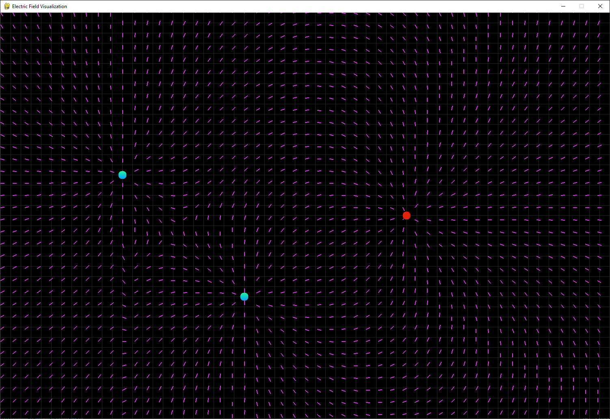

# electric-field-simulation
Visualization of electric field in a plane due to charges present along a line 

  

  

<b> Blue Charges signify negative charges </b>  
<b> Red Charges signify positive charges </b>  

